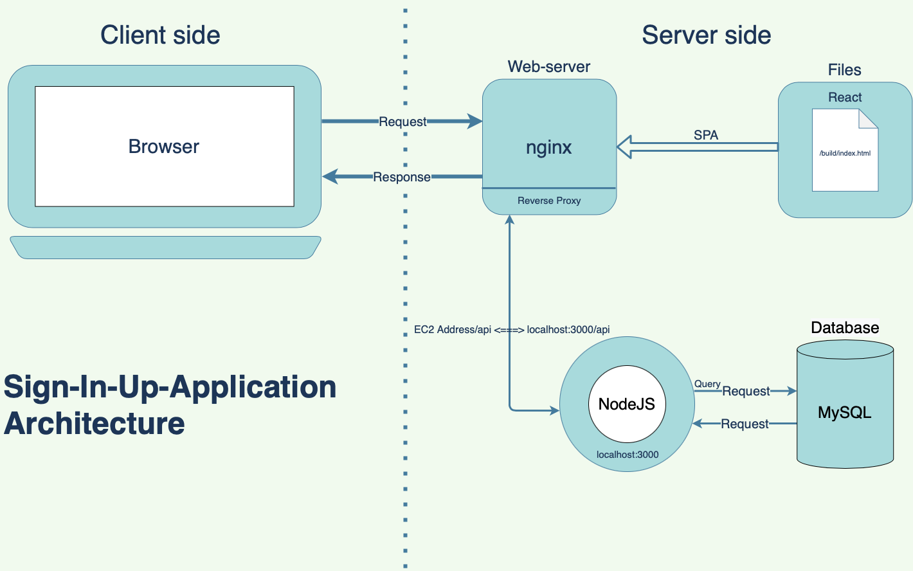

# Sign-In-Up-Application

## 요약

아이디와 비밀번호를 입력하여 로그인, 회원가입을 할 수 있는 간단한 SPA(Single-Page-Application)입니다.

***

## 기술스택

### Client-side
- React
- Bootstrap
### Server-side
- nginx(Web-server)
- NodeJS(Vanilla)

### Database
- MySQL
### Deploy
- EC2(ubuntu) of AWS

***

## 자세히
    1. 디렉토리 구조
        ├── README.md                 - README file
        │
        ├── client                    - client-side
        │   ├── package.json          - npm 설정
        │   ├── models.py             - 서버 모델 정의
        │   │── views.py              - 서버 뷰 함수(API 엔드포인트) 정의
        │   │ 
        │   ├── src/                  - 클라이언트 사이드 폴더
        │   │   ├── App.js            - main component
        │   │   ├── App.css           - main css
        │   │   ├── auth.js           - axios functions
        │   │   ├── components/       - 리액트 컴포넌트
        │   │
        │   ├── public/               
        │   │   ├── images/           - img
        │ 
        ├── dbConfig.js               - DB(MySQL) config
        ├── dbConfigInfo.json         - DB info(pw, db 이름 등)  // git ignored
        ├── package.json              - npm 설정
        └── server.js                 - NodeJS script        

    2. 전체 로직 맵

  

        
    3. 웹 스크린샷(메인, )

  

    4. 향후 추가할 기능 

## 보완점 개발 예정 로드맵
    1. https
    2. jwt
    3. refactoring(node를 중점으로)

## 개발 후기
### 어려웠던 부분

### 느낀점

</>

